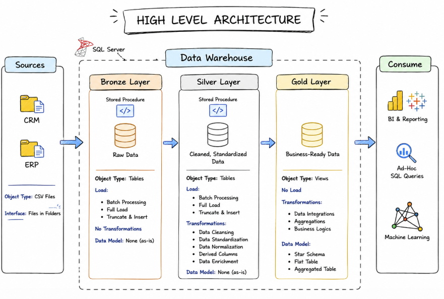
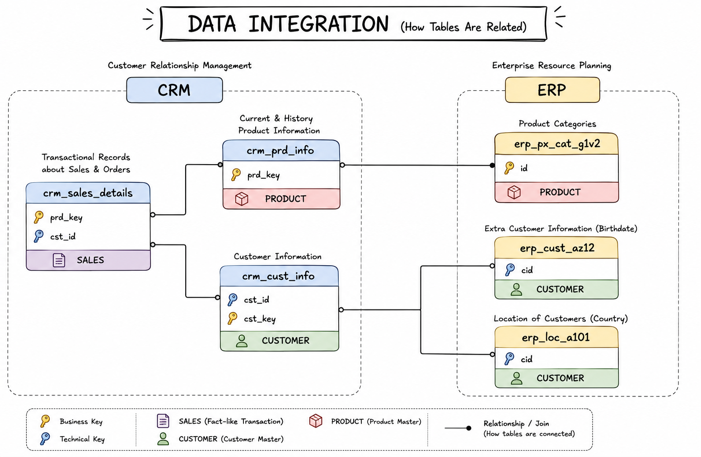
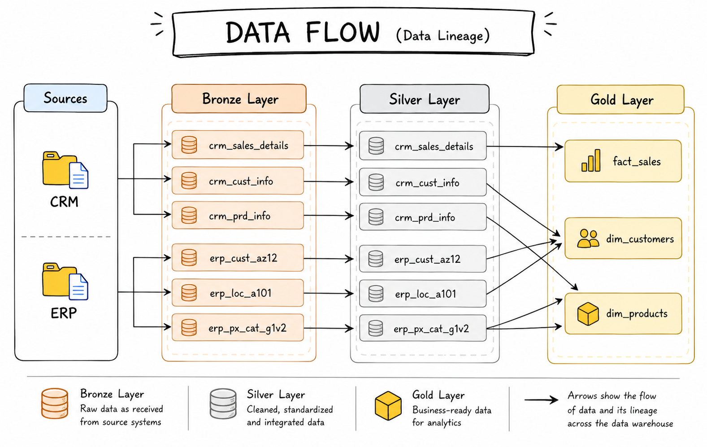
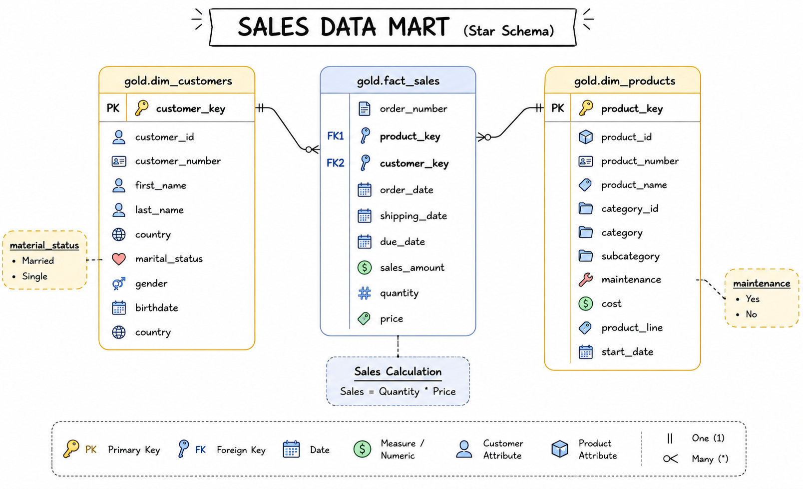

# SQL Data Warehouse Development

## Overview

This project demonstrates the end-to-end development of a modern SQL Data Warehouse using SQL Server. It implements the Medallion Architecture to transform raw CRM and ERP data into a clean, standardized, and business-ready analytical model.

The project covers the complete ETL workflow, including data ingestion, transformation, standardization, dimensional modeling, quality validation, and analytical data preparation for reporting.

---

## Data Architecture

The warehouse follows the Medallion Architecture consisting of Bronze, Silver, and Gold layers.



### Bronze Layer

The Bronze layer ingests raw data from CRM and ERP source systems without applying business transformations. It serves as the landing zone where source data is preserved in its original format.

During this phase, the implementation includes:

- Database initialization
- Schema creation
- Source table creation
- Bulk data loading using `BULK INSERT`
- Stored procedure-based data ingestion
- Full-load ETL implementation
- Load execution logging
- Error handling using `TRY...CATCH`
- Initial load validation

No business rules or data cleansing are applied in this layer, ensuring the original source data remains unchanged.

### Silver Layer

The Silver layer transforms raw operational data into a clean, standardized, and validated dataset suitable for downstream analytics.

The transformation process includes:

- Duplicate detection and removal
- Data quality validation
- Handling missing and invalid values
- Data type corrections
- String standardization
- Date standardization
- Business rule implementation
- Historical product record handling
- Derived column generation
- Source system integration
- Metadata tracking

This layer improves data consistency and prepares the warehouse for dimensional modeling.

### Gold Layer

The Gold layer delivers business-ready analytical data using a Star Schema designed for reporting and business intelligence.

This layer includes:

- Star Schema implementation
- Customer dimension
- Product dimension
- Sales fact model
- Business-oriented analytical views
- Surrogate key generation
- Fact-to-dimension relationships
- Final quality validation

The resulting model is optimized for analytical queries and reporting workloads.

---

## Engineering Scope

This project implements the complete data engineering workflow required to build a modern SQL Data Warehouse.

The implementation includes:

- Database and schema design
- Multi-source data integration
- ETL pipeline development using stored procedures
- Bronze, Silver, and Gold layer implementation
- Data cleansing and standardization
- Business rule implementation
- Historical data handling
- Surrogate key generation
- Dimensional modeling using Star Schema
- Data quality validation
- Business-ready analytical modeling

---

## Dataset

The warehouse integrates data from two independent business systems.

### CRM

- Customer Information
- Product Information
- Sales Details

### ERP

- Customer Information
- Customer Location
- Product Categories

### Source Data Integration

The CRM and ERP source systems contain related business entities that are integrated during the transformation process to build a unified analytical model.



---

## Technologies Used

- SQL Server
- SQL Server Management Studio (SSMS)
- T-SQL
- Draw.io
- Git
- GitHub

---

## Repository Structure

```text
sql-data-warehouse-development
│
├── datasets
│   ├── source_crm
│   └── source_erp
│
├── docs
│   ├── data_architecture
│   ├── data_catalog
│   ├── data_flow
│   ├── data_integration
│   ├── data_model
|   └── naming_conventions
│   
│   
│
├── scripts
│   ├── bronze
│   ├── silver
│   ├── gold
│   └── init_database.sql
│
├── tests
│
└── README.md
```

---

## ETL Workflow

The warehouse follows a layered ETL process.

The complete data lineage illustrates how CRM and ERP source tables move through the Bronze, Silver, and Gold layers before becoming analytical dimensions and fact models.



1. Ingest raw CRM and ERP data into the Bronze layer.
2. Clean, validate, standardize, and integrate data in the Silver layer.
3. Build dimensional models and analytical views in the Gold layer.
4. Execute quality checks to validate the final warehouse before reporting.

---

## Gold Layer Data Model

The Gold layer is designed using a Star Schema to support analytical reporting.



### Dimension Tables

- `dim_customers`
- `dim_products`

### Fact Table

- `fact_sales`

---

## Project Documentation

The `docs` directory contains architecture diagrams and supporting documentation created throughout the warehouse development process.

| Document | Description |
|----------|-------------|
| High Level Architecture | Medallion Architecture showing the Bronze, Silver, and Gold warehouse layers |
| Data Integration | Relationship between CRM and ERP source tables |
| Data Flow | End-to-end data lineage from source systems to analytical models |
| Sales Data Mart Star Schema | Gold layer dimensional model consisting of dimension and fact tables |

---

## Engineering Highlights

Throughout the implementation, the following engineering tasks were completed:

- Designed a three-layer Medallion Architecture
- Integrated CRM and ERP source systems into a unified warehouse
- Developed reusable ETL pipelines using stored procedures
- Loaded raw data using `BULK INSERT`
- Applied data cleansing and standardization techniques
- Implemented business validation rules during transformation
- Managed historical product records
- Generated surrogate keys for dimensional modeling
- Designed a Star Schema consisting of dimension and fact models
- Built analytical views for reporting
- Performed data quality validation across all warehouse layers
- Documented the architecture, ETL workflow, data flow, and warehouse design

---

## Learning Outcomes

This project provided practical experience in designing and implementing a modern SQL Data Warehouse while applying data engineering principles throughout the ETL lifecycle.

### Data Warehousing

- Implemented a Medallion Architecture to separate raw, cleaned, and business-ready data into Bronze, Silver, and Gold layers.
- Designed a layered warehouse that supports maintainability, scalability, and clear separation of responsibilities across each stage of the ETL pipeline.
- Structured the warehouse to transform operational CRM and ERP data into an analytical model suitable for reporting.

### Data Engineering

- Developed reusable ETL pipelines using stored procedures to execute Bronze and Silver layer processing in a consistent and organized manner.
- Integrated CRM and ERP datasets into a unified warehouse by applying common business rules and standardized data structures.
- Implemented a full-load ETL strategy using `TRUNCATE` and `BULK INSERT` to refresh warehouse data during each execution.
- Applied data validation throughout the ETL process to ensure reliable data moved between warehouse layers.

### Data Transformation

- Cleaned and standardized customer, product, sales, and ERP datasets before loading them into the analytical layer.
- Applied business rules to correct inconsistent values, handle missing data, standardize formats, and derive additional business attributes.
- Reconstructed historical product information by identifying valid product records using window functions.
- Generated metadata columns to track warehouse load timestamps across transformed tables.

### Dimensional Modeling

- Designed the Gold layer using a Star Schema consisting of customer and product dimensions linked to a centralized sales fact model.
- Generated surrogate keys for dimension tables to establish stable relationships independent of source system business keys.
- Built business-oriented views that simplify analytical querying while hiding transformation complexity from reporting users.

### SQL Development

- Used advanced T-SQL to implement the complete ETL pipeline across all warehouse layers.
- Applied window functions such as `ROW_NUMBER()` to remove duplicate customer records and generate surrogate keys, and `LEAD()` to reconstruct historical product records.
- Used Common Table Expressions (CTEs) to simplify multi-step transformation logic before inserting cleaned data into Silver tables.
- Developed stored procedures to orchestrate Bronze and Silver layer execution, improving code organization and reusability.
- Created SQL views in the Gold layer to expose business-ready dimension and fact models for analytical reporting.
- Used `BULK INSERT` during Bronze layer ingestion to efficiently load raw CRM and ERP source files into SQL Server.
- Implemented error handling using `TRY...CATCH` blocks within ETL procedures to capture failures, report execution status, and improve pipeline reliability.
